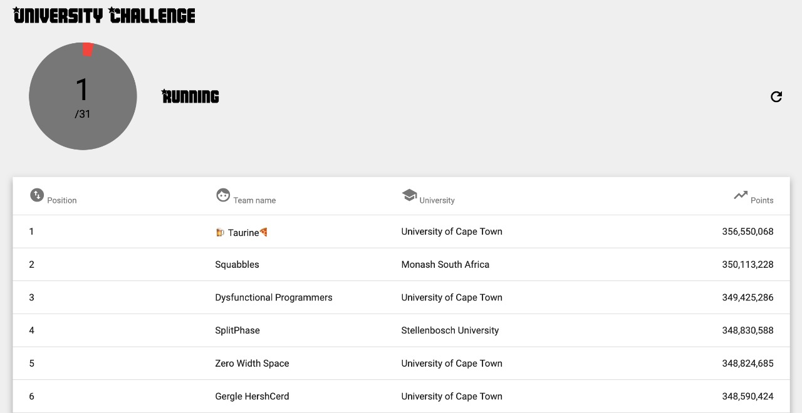
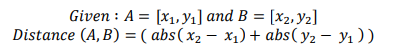

# Entelect University Challenge

We took part in the Entelect University Cup, managing to land first place on the leaderboard just before it was frozen in the final hour and ultimately placed second! A great experience was had by all for our first time working together as a team on this style of optimisqation challenge.

## Team Name: *🍺Taurine🍕*
## Team Members:
* [Luc Hayward](https://github.com/LucHayward)
* [Stuart Mesham](https://github.com/StuartMesham)
* [Keegan White](https://github.com/keegan337)

## Final Leaderboard


### Details
* Saturday 4th August
* 8:30-15:00

## Approach
We ended up running two seperate approaches for this competition. We ran either a "greedy" method in which all workers were sent to the closest location of value at any given time. Or a "simple" method in which a single worker followed the "greedy" algorithm rather than many workers (see below). The best scores from each algorithm were submitted in order to maximise our chances. Unfortunately, we were unable to utilise the more sophisticated "greedy" algorithm for the larger of the two inputs which we believe would have given us the necessary points to capture the top place.

```Java
/**
	 * This is a very simple dumb implementation using only one worker, used for 1,4,5
	 */
	private static void simple() {
		Worker worker = workers.get(0);
		while (!isFinished()) {
				worker.visit(getWorkerNearestAction(worker));
		}
		System.out.println(worker);
	}


	/**
	 * A greedy implementation using all workers, used for number 3
	 */
	private static void greedy() {
		
		long totalCost = 0l;
		
		while (!isFinished()) {
			//Find cheapest next option
			Worker worker = null;
			Location nextOption = null;
			int minDistance = Integer.MAX_VALUE;

			for (Worker tempWorker : workers) {
				Location potentialNextOption = getWorkerNearestAction(tempWorker);
				if (potentialNextOption == null) continue;
				int tempDist = Coordinate.distanceBetween(tempWorker.position, potentialNextOption.coordinate);
				if (tempDist < minDistance) {
					minDistance = tempDist;
					worker = tempWorker;
					nextOption = potentialNextOption;
				}
			}
			
			worker.visit(nextOption);
			totalCost += minDistance;
			
			if (totalCost > Budget) {
				System.err.println("This should never happen...");
				System.exit(-1);
			}
		}
	}
```

## Pre-freezing Leaderboard (1 hour remaining)


# Main Challenge
### (Special thanks to [Angus Mackenzie](https://github.com/AngusTheMack) for having written up a great ReadMe on [his repo](https://github.com/AngusTheMack/entelect))
## Problem Description
A department at a specific military base that specializes in the mining and refining of the natural elements has approached you with a problem. They have sites where they have implemented automated worker drones to gather resources from mines and transport those resources to their factories for processing.

The problem they are currently facing is that the AI to control these drones are far from efficient, causing the worker drones to go to every single factory after picking up minerals instead of just going to the mine's assigned factory, which ends up costing them a lot of unnecessary money.

Your task is to minimize the cost of running these automated mining drones by finding the shortest route between all the mines and factories, whilst depleting all resources from each mine.

The cost of each running a worker is R1 per single unit of distance. Each map will have an assigned budget to it, which you must try to lower as much as possible. 
Distance is calculated by the [Manhattan distance formula](https://en.wikipedia.org/wiki/Taxicab_geometry):



## Map
Your mining areas can be represented as a rectangular grid of height R and length C. The
mining area is covered with various mines and factories for different elements of the periodic
table. The coordinates for the mines are [𝑟, 𝑐] (where 0 < 𝑟 ≤ 𝑅 𝑎𝑛𝑑 0 < 𝑐 ≤ 𝐶 ).

## Workers 
You will have access to three types of workers with different inventory limits:
* Miners – Can carry a maximum of 1 resource.
* Excavators – Can carry a maximum of 3 resources.
* Haulers – Can carry a maximum of 5 resources.

You will have a miner count M, excavator count E and hauler count H for each map, which
will indicate the number of each type of worker you will have available to mine that area.
A worker can hold exactly one of any type of resource and can have a combination of different
resources from different mines, given that it has the capacity. Each worker can only hold one
of each type of resource, i.e. a worker will not be able to collect a resource from a mine that
it already has a resource for in its inventory. It will need to deposit that resource at an
associated factory before collecting the same resource from the same type of mine. Workers
do not need to completely fill their inventory before visiting a factory or another mine.

## Mines and Factories
There is a total of 118 unique elements on the periodic table, all of which will be available to be mined from the various maps provided. Mines will be denoted as the element’s symbol in full uppercase, and the respective factory will be denoted as the element’s symbol in full lowercase.

Each mine will hold a unique element within it, any resource mined from it will have to be delivered to the respective factory for it to be processed correctly. Example only resources collected from an Iron (FE) mine can be deposited to an Iron factory (fe) to be processed.

Each map will have a varying number of mines MN and factories F. All mines and factories will be given a unique index, which you will use to identify every individual building (mine or factory).

Workers carrying multiple types of resources will only deposit the relevant resources to a factory and will deposit no resources if the worker does not have resources that the factory can process.

## Resources
Each mine will hold varying amounts of resources that can be mined and will have to be delivered to their respective factories to be able to be processed. Visiting a factory without any resources that can be processed by that factory will be a wasted moved, so always ensure when visiting a factory, to have the correct resources in the worker.
Once a worker is at full capacity, that worker will not pick up any new resources when visiting new mines, until those resources have been delivered to the correct factory.

## Output File
Each line in the submission file must contain F lines, one for each worker.
Each line describing the worker’s actions will contain the worker type separated from the series of movement commands for that worker separated by a pipe ‘|’. The commands thereafter will need to be comma separated. The commands of which mines or factories to visit must be denoted by the index provided for that respective mine or factory.

Example Output File
```
M|0,4,1,5
M|2,6,2,7
E|3,2,6,8
E|3,0,4,8
```

## Scoring
Only the solution file submitted will be processed and scored once submitted. The source code provided will be required for verification purposes and will not be run during the duration of the challenge.

Each team’s goal is to get the highest Overall Score possible. For each map, the Map Score is calculated by the Map Total Distance travelled by all workers, including miners, excavators, and haulers (this is the result of your submission), subtracted from a predefined Map Budget Distance (provided) for that map which results in the Total Score for that map. The sum of Total Scores for each map is the team’s Overall Score.

Example
```
Map 1 Budget Distance = 30
Map 1 Total Distance = 5
Map 1 Total Score = Map 1 Budget - Map 1 Total Distance
Map 1 Total Score = 25

Map 2 Budget Distance = 50
Map 2 Total Distance = 45
Map 2 Total Score = Map 2 Budget - Map 2 Total Distance
Map 2 Total Score = 5

Overall Score = Map 1 Total Score + Map 2 Total Score
Overall Score = 30
```
